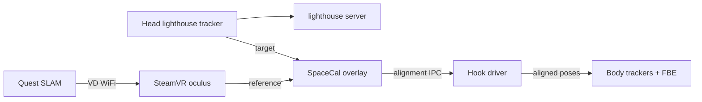

<picture>
  <source media="(prefers-color-scheme: dark)" srcset=".github/logo_light.png">
  <source media="(prefers-color-scheme: light)" srcset=".github/logo_dark.png">
  
</picture>

# OpenVR-SpaceCalibrator — Quest SLAM continuous calibration fork

**Version:** `1.5.1-gore-contcal7`  
**Base:** [hyblocker/OpenVR-SpaceCalibrator](https://github.com/hyblocker/OpenVR-SpaceCalibrator) `develop`  
**License:** MIT (see [LICENSE](LICENSE))

Continuous calibration fixes for **wireless Quest (or other SLAM HMDs) + lighthouse body/head trackers** in SteamVR — the setup [hyblocker #50](https://github.com/hyblocker/OpenVR-SpaceCalibrator/issues/50) describes as intermittent 3–6 cm drift bursts. Upstream v1.5.1 does not ship these SLAM-specific fixes.

---

## The problem

Wireless Quest VRChat with lighthouse FBT sounds ideal: untethered headset, sub-millimeter body trackers. In practice you run **two tracking universes** that slowly diverge:

1. **Quest SLAM** (`oculus` in SteamVR) — inside-out cameras + IMU, guardian-bound, drifts in yaw and position.
2. **Lighthouse trackers** — precise but in a separate SteamVR origin.

SpaceCal bridges them using a **head-mounted lighthouse tracker** as the calibration target. Stock continuous calibration was built for Index-class setups where reference and target share similar noise profiles. On Quest + Virtual Desktop, reference poses are jittery, latency-skewed, and occasionally poisoned by guardian shifts — which produces the [#50 failure mode](https://github.com/hyblocker/OpenVR-SpaceCalibrator/issues/50): feet slide 3–6 cm for several seconds, then snap back.

**This fork** retunes the continuous calibration loop for that SLAM reference: spike gates, guardian debounce, lock-relative gating, bad-frame pruning, and SLAM-specific presets.



---

## Who this is for

| You have | You want |
|----------|----------|
| Meta Quest / Quest Pro / Pico / other **inside-out HMD** via **Virtual Desktop**, ALVR, or Air Link | Lighthouse FBT (Vive/Tundra trackers) that stays locked in VRChat |
| A **head-mounted lighthouse tracker** (Tundra, Vive 3.0, etc.) | Automatic recovery when Quest guardian or SLAM drifts |
| SteamVR + basestations | Better cont-cal than stock SpaceCal without switching to SpaceOverride |

**Typical chain:** `oculus` (Quest) → `lighthouse` (head tracker) → body trackers aligned to the same space.

**Not for:** Native Index/PCVR-only setups with one tracking system (use upstream SpaceCal). Wired Quest Link users may benefit but VD latency tuning is what this fork optimizes for.

---

## What this fork adds (contcal1–5)

| Area | Improvement |
|------|-------------|
| **SLAM preset** | Auto-applied for Quest-class references: trust lighthouse yaw, no pause on SLAM jitter, latency compensation |
| **Sampling** | Fixed continuous `CollectSample` gate; spike rejection; adaptive spike threshold vs live jitter |
| **Guardian** | Detects universe/origin shifts; debounced thresholds for VD (35 mm / 5° / 3 confirms) |
| **Lock-relative** | Gated updates — stops applying FULL correction every tick (major drift source) |
| **Bad frames** | Prunes poisoned samples on VD latency / `willDriftInYaw` / invalid tracking |
| **Reliability** | IPC connect retry; dual-path deploy docs; 1 Hz session metrics when cont-cal runs |
| **Multi-chain** | Multiple calibration chains in one profile (P3) |

Full per-version notes: [docs/CHANGELOG-contcal.md](docs/CHANGELOG-contcal.md)

---

## How it works (30 seconds)

SteamVR runs **two tracking universes** at once: Quest SLAM (`oculus`) and lighthouse. They drift apart over time.

SpaceCal sits between them:

1. **Overlay** samples Quest pose + head tracker pose each tick.
2. **Solver** computes alignment transform (continuous or one-shot).
3. **Driver hook** applies that transform to lighthouse devices so feet/body match the Quest playspace.

This fork tunes that loop for **high-jitter SLAM references** and **VD network latency**.

**Saved calibration vs continuous calibration**

| Mode | Behavior |
|------|----------|
| Saved only | Driver applies last profile — feels "on" but does not refine |
| **Continuous** | Active refinement + metrics — **required** for long Quest sessions |

Enable **autostart continuous calibration** in the overlay and save your profile.

---

## Requirements

- Windows 10/11, SteamVR 2.x
- [Visual C++ Redistributable x64](https://aka.ms/vs/17/release/vc_redist.x64.exe)
- Quest (or SLAM HMD) via **Virtual Desktop** (or ALVR) into SteamVR
- **2+ lighthouse basestations**, lighthouse-compatible trackers
- **Head-mounted lighthouse tracker** (Vive 3.0 recommended for best results; Tundra supported)
- Optional: [Standable FBE](https://store.steampowered.com/app/2370570/) or other body tracking

---

## Install

### Option A — Build from source (recommended for this fork)

See [Build](#build-from-source) and [Deploy](#deploy-to-steamvr) below. Prebuilt binaries: [GitHub Releases](https://github.com/charliee1w/OpenVR-SpaceCalibrator-Quest/releases) (`v1.5.1-contcal7`).

### Option B — Steam Space Calibrator + replace binaries

1. Install [Space Calibrator on Steam](https://s.team/a/3368750) (provides driver registration).
2. Build this fork and copy `SpaceCalibrator.exe` + `driver_01spacecalibrator.dll` over the Steam install (see Deploy).
3. Disable duplicate autolaunch if you have the legacy `pushrax` GitHub install.

---

## Quick start (Quest + VD + head tracker)

1. **SteamVR:** Set HMD driver to `oculus` (Virtual Desktop). Basestations on.
2. **Power on** only the head tracker first.
3. Open **Space Calibrator** from the SteamVR dashboard.
4. **Reference:** your Quest HMD (`oculus`). **Target:** head tracker (`lighthouse`).
5. Click **Copy Chaperone** once (copies guardian into profile).
6. Run **Start Calibration** → cancel if prompted → enable **Continuous Calibration**.
7. Enable **Lock relative position**, **Static recalibration**, **Guardian auto-apply** (recommended).
8. Enable **Autostart continuous calibration** → **Save profile**.
9. Turn on body trackers. Move for ~30 s to settle.

SLAM preset applies automatically when continuous cal starts (`SlamReferencePreset` in logs).

### Recommended starting sliders (Quest/VD)

| Setting | Value | Notes |
|---------|-------|-------|
| Jitter threshold | 0.15 | SLAM preset default |
| Max relative error | 0.008 | contcal5 preset |
| Recalibration threshold | 1.5 | Increase if corrections feel aggressive |
| Tracker offset XYZ | tune per mount | Biggest lever for lean/slide — see [docs/P4_TUNING.md](docs/P4_TUNING.md) |

---

## Build from source

**Prerequisites:** Visual Studio 2022, CMake 3.20+, Git submodules initialized.

```powershell
git clone --recurse-submodules https://github.com/charliee1w/OpenVR-SpaceCalibrator-Quest.git
cd OpenVR-SpaceCalibrator-Quest
.\GenWin64.bat
cmake --build bin --config Release
```

**Outputs:**

| Artifact | Path |
|----------|------|
| Overlay | `bin/artifacts/Release/SpaceCalibrator.exe` |
| Driver | `bin/driver_01spacecalibrator/bin/win64/driver_01spacecalibrator.dll` |

Single-target overlay build:

```powershell
cmake --build bin --config Release --target SpaceCalibratorOverlay
```

---

## Deploy to SteamVR

SteamVR loads the driver from **two** locations — both must match.

### 1. Steam library app (overlay autolaunch)

```
Steam/steamapps/common/01spacecalibrator/
  SpaceCalibrator.exe
  driver.vrdrivermanifest
  bin/win64/driver_01spacecalibrator.dll
```

### 2. SteamVR drivers folder (vrserver loads this first)

```
Steam/steamapps/common/SteamVR/drivers/01spacecalibrator/
  driver.vrdrivermanifest
  bin/win64/driver_01spacecalibrator.dll
```

**Deploy script (run with SteamVR stopped):**

```powershell
.\scripts\deploy.ps1
.\scripts\validate-install.ps1
```

Or manually copy from `bin/artifacts/Release` and `bin/driver_01spacecalibrator/`. Remove any `*.dll.stale` in the drivers folder. Restart SteamVR.

**Verify:**

```powershell
.\scripts\validate-install.ps1
# or manually:
Test-Path "SteamVR\drivers\01spacecalibrator\bin\win64\driver_01spacecalibrator.dll"
# Driver log should show: 1.5.1-gore-contcal7 loaded
```

---

## Troubleshooting

| Symptom | Fix |
|---------|-----|
| **Driver unavailable** | Missing DLL under `SteamVR\drivers\01spacecalibrator\` — see Deploy |
| **Old binary running** | Disable `pushrax.SpaceCalibrator` autolaunch; confirm dashboard launches `01spacecalibrator` |
| **Feels locked but no metrics** | Start **Continuous Calibration** (or autostart); saved-only mode does not log |
| **FBT slides after 5–10 min** | Enable continuous cal + guardian auto-apply; check VD WiFi stability |
| **Feet lean / height wrong** | Tune tracker offset XYZ in overlay |
| **Guardian recal too often** | contcal5 debounce should help; check VD guardian isn't resetting |

Driver log: `SteamVR/drivers/01spacecalibrator/bin/win64/space_calibrator_driver.log`  
Metrics log: `%LOCALAPPDATA%\..\LocalLow\SpaceCalibrator\Logs\spacecal_log.*.txt`

Analyze latest session:

```powershell
.\scripts\analyze-spacecal-log.ps1 -Latest
.\scripts\run-p4-validation.ps1 -AnalyzeOnly    # 10+ min P4 check
.\scripts\run-head-ab-session.ps1 -Compare      # Tundra vs Vive 3.0 A/B
```

---

## Tuning and metrics

- Session logs write **1 row/second** while continuous cal is active (no debug checkbox needed).
- Tuning guide: [docs/P4_TUNING.md](docs/P4_TUNING.md)
- Tracking stack research: [docs/TRACKING_RESEARCH.md](docs/TRACKING_RESEARCH.md)
- Roadmap & ceiling: [docs/ROADMAP.md](docs/ROADMAP.md)

**P4 pass heuristic:** ≥10 min session, median `error_byRelPose` < 15 mm, subjective "locked" FBT.

### What success looks like (realistic ceiling)

This is a **hook-driver alignment** between SLAM and lighthouse — not a single fused tracking system. Expectations:

| State | Typical residual error | Subjective feel |
|-------|------------------------|-----------------|
| At rest, tuned | ~5–10 mm | Feet planted, minor lean fixable via offset XYZ |
| Walking / dancing | ~10–20 mm | Occasional micro-slide on bad WiFi or guardian events |
| Guardian reset / VD dropout | Brief burst until cont-cal recovers | contcal5 prunes bad frames and debounces guardian |

You cannot software-fix Quest SLAM drift inside Meta's runtime, VD network latency, or lighthouse occlusion. For a higher ceiling, compare [SpaceOverride](#vs-spaceoverride) with a Vive 3.0-class head tracker (see [docs/TRACKING_RESEARCH.md](docs/TRACKING_RESEARCH.md)).

---

## vs SpaceOverride

| | This fork (SpaceCal cont-cal) | [SpaceOverride](https://github.com/Nyabsi/OpenVR-SpaceOverride) |
|--|------------------------------|------------------------------------------------------------------|
| Approach | Align SLAM ↔ lighthouse continuously | Replace HMD pose with tracker pose |
| Head tracker | Calibration bridge | Drives the view — needs Vive 3.0 class stability |
| VD Quest | Supported (this fork's focus) | Supported |
| Best when | Keep Quest as HMD reference, align body | Want lighthouse-native HMD pose |

Both can be installed; they solve alignment differently. See [docs/TRACKING_RESEARCH.md](docs/TRACKING_RESEARCH.md) for ceiling analysis.

---

## Documentation index

| Doc | Contents |
|-----|----------|
| [docs/CHANGELOG-contcal.md](docs/CHANGELOG-contcal.md) | contcal1–5 changes |
| [docs/DEPLOYMENT.md](docs/DEPLOYMENT.md) | Operator deploy checklist |
| [docs/P4_TUNING.md](docs/P4_TUNING.md) | Metrics-driven tuning |
| [docs/TRACKING_RESEARCH.md](docs/TRACKING_RESEARCH.md) | Per-layer tracking research |
| [docs/ROADMAP.md](docs/ROADMAP.md) | Phases + logical ceiling |
| [docs/PUBLISHING.md](docs/PUBLISHING.md) | Maintainer release checklist |
| [profiles/README.md](profiles/README.md) | Example profile format |

---

## Contributing

1. Fork from `develop`-based branch.
2. Tag fork releases `1.5.1-gore-contcalN` in `src/common/Version.h`.
3. Document behavioral changes in `docs/CHANGELOG-contcal.md`.
4. Quest/SLAM fixes are welcome upstream via [hyblocker #50](https://github.com/hyblocker/OpenVR-SpaceCalibrator/issues/50).

---

## Credits

- [pushrax](https://github.com/pushrax/OpenVR-SpaceCalibrator) — original Space Calibrator
- [hyblocker](https://github.com/hyblocker/OpenVR-SpaceCalibrator) — continuous calibration, Steam release
- This fork — Quest/VD SLAM tuning (contcal series)

---

## Disclaimer

Experimental fork. Not affiliated with Valve, Meta, Virtual Desktop, or hyblocker. Lighthouse + PCVR streaming involves multiple vendors; results depend on basestation layout, WiFi, and tracker mount. **Use at your own risk** in social VR — test before relying on FBT in public worlds.