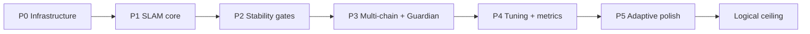

# Roadmap — Quest SLAM → lighthouse cont-cal fork

**Last updated:** 2026-06-20  
**Current:** `1.5.1-gore-contcal5` — research-driven algorithm release  
**Audience:** Contributors and power users — ordered phases ending at the **logical ceiling** for this architecture.

---

## Executive summary

This fork improves **continuous calibration** when the **reference is SLAM** (Quest via VD) and the **target is lighthouse** (head tracker). The roadmap moves from **infrastructure reliability** → **SLAM-specific tuning** → **measurement-driven polish** → **architecture limits** (ceiling).



---

## Phase 0 — Infrastructure & deploy ✅ DONE

**Goal:** SpaceCal launches, driver loads, IPC works, correct binary runs.

| Item | Status |
|------|--------|
| Fix `SteamVR\drivers\01spacecalibrator` stale/missing DLL | ✅ |
| `driver.vrdrivermanifest` in SteamVR drivers folder | ✅ |
| Deploy contcal4 to `01spacecalibrator` | ✅ |
| Disable duplicate `pushrax` autolaunch | ✅ |
| IPC connect retry (autolaunch race) | ✅ in tree |
| Version bump for IPC patch | ✅ contcal5 |

**Exit criteria:** No `driver unavailable`; `vrserver` loads `01spacecalibrator`; user can start cont-cal from dashboard.

---

## Phase 1 — SLAM reference core ✅ DONE (contcal1–2)

**Goal:** Correct math and sampling for Quest-class reference tracking.

| Item | Version | Status |
|------|---------|--------|
| `CollectSample` continuous logic fix | contcal2 | ✅ |
| `ApplySlamReferencePreset` | contcal2 | ✅ |
| `trustTargetYaw` (lighthouse owns yaw) | contcal2 | ✅ |
| `rejectYawDriftPoses` / `willDriftInYaw` gate | contcal2 | ✅ |
| `poseTimeOffset` + sample skew limits | contcal2 | ✅ |
| Head model on SLAM reference | contcal2 | ✅ |
| Spike rejection on continuous samples | contcal1 | ✅ |
| Frozen offset + static recal | contcal1 | ✅ |
| 40-sample window | contcal1 | ✅ |
| `jitterTarget` metrics fix | contcal1 | ✅ |

**Exit criteria:** Cont-cal runs on oculus→lighthouse without aborting on normal Quest jitter; first metrics show low `error_byRelPose`.

**Evidence:** `spacecal_log.2026-06-20T20-53-47.txt` — 8 mm rel-pose, zero active correction on hold.

---

## Phase 2 — Stability under real play ✅ DONE (contcal2–3)

**Goal:** Corrections feel invisible; bad frames don't move the solver.

| Item | Status |
|------|--------|
| Tracking quality state machine | ✅ |
| Pause behavior: no pause on SLAM jitter (`pauseOnReferenceJitter=false` in preset) | ✅ |
| Slow calibration speed for SLAM | ✅ |
| Incremental cal with outlier ignore | ✅ |
| Lock relative position (user profile) | ✅ configured |

**Exit criteria:** User reports stable FBT feel in normal play (achieved 2026-06-20).

---

## Phase 3 — Guardian & multi-chain ✅ DONE (contcal4)

**Goal:** Survive Quest guardian shifts and support multiple cal chains in one profile.

| Item | Status |
|------|--------|
| `GuardianDrift.cpp` — universe / origin / geometry detection | ✅ |
| Auto-recal on guardian drift (clear calc + cooldown) | ✅ |
| `CalibrationChain` — multi-chain continuous cal | ✅ |
| Profile load/save for chains | ✅ |
| UI chain list | ✅ |

**Guardian thresholds (current code):**

- Translation drift &gt; 20 mm or yaw &gt; 3° → drift event
- Cooldown: 20 frames after handling

**Exit criteria:** Guardian reset doesn't permanently corrupt lighthouse alignment (subjective + `GuardianDrift` log annotations).

**Follow-up:** Thresholds may be too aggressive for VD micro-shifts — tune in Phase 4/5.

---

## Phase 4 — Measurement & profile tuning 🔄 IN PROGRESS

**Goal:** Turn “works really well” into **reproducible** configs with logged evidence.

| Item | Priority | Status |
|------|----------|--------|
| 10+ min sessions with debug logs enabled | P0 | 🔄 S1a pending (auto-log on cont-cal start added) |
| Tune `continuousCalibrationThreshold` (default 1.5) | P1 | ⬜ |
| Tune `jitterThreshold` (SLAM preset 0.15) | P1 | ⬜ |
| Tune `maxRelativeErrorThreshold` (0.005) | P1 | ⬜ |
| Tune head `continuousCalibrationOffset` XYZ | P0 | 🔄 S1 first experiment queued |
| Document winning profile JSON in repo | P2 | 🔄 baseline at `profiles/p4-baseline-2026-06-20.json` |
| Compare Tundra vs Vive 3.0 head (hardware) | P2 | ⬜ planned |
| A/B vs SpaceOverride (different architecture) | P3 | ⬜ installer ready, not installed |

**Recommended test protocol:**

1. Enable debug logs → Mark baseline  
2. Stand 30s, walk guardian, 10 min FBT  
3. Review: `error_byRelPose`, `calibrationApplied`, `GuardianDrift` count  
4. Adjust one slider per session; save profile  

**Exit criteria:** Saved profile with metrics showing &lt;15 mm rel-pose for 10+ minutes; user subjective “locked”.

---

## Phase 5 — Adaptive polish (contcal5) ✅ SHIPPED (2026-06-20)

**Goal:** Less manual slider tuning; system adapts to live VD/SLAM conditions.

| Item | Effort | Impact |
|------|--------|--------|
| Bump version to `contcal5`; ship IPC retry officially | S | Reliability |
| **Adaptive spike threshold** — scale with `jitterRef` | M | High |
| **Guardian debounce** — ignore sub-threshold VD guardian noise | M | High |
| **Per-axis alignment speed** — slow yaw, faster translation | M | Medium |
| **Tick skip on reference health** — skip whole cal tick when `willDriftInYaw` or jitter spike | M | Medium |
| **Auto session logging** — CSV on cont-cal start without debug checkbox | S | Tuning velocity |
| **Hardware presets** — `TundraHead` vs `Vive3Head` profile templates | S | Medium |
| Expose `continuousSpikeThresholdM` / guardian thresholds in UI or profile JSON | S | Medium |

**Exit criteria:** Stable metrics across variable VD nights without per-session slider tweaks.

---

## Phase 6 — Ecosystem & maintenance 📋 OPTIONAL

**Goal:** Sustainable fork; upstream awareness; clean installs.

| Item | Notes |
|------|-------|
| Restore Steam `appmanifest_3368750.acf` + install script | Clean deploy path |
| CI build artifact zip (overlay + driver) | One-copy deploy |
| Post-install validator script | Checks DLL, pipe, manifest paths |
| Upstream PR subset (SLAM preset, CollectSample fix) | hyblocker #50 — likely partial accept |
| Changelog per contcalN tag | User-facing |

---

## Logical ceiling — what “really good” can and cannot mean

The ceiling is set by **physics of the tracking stack**, not by more application code. SpaceCal is a **pose-space alignment layer** between two already-fused tracking pipelines. It cannot invent information that neither pipeline provides.

### Achievable ceiling (with this architecture, well-tuned)

| Metric | Realistic best case |
|--------|---------------------|
| Static standing alignment | **5–10 mm** rel-pose error sustained |
| Walking / moderate FBT | **10–20 mm** effective; corrections rare and imperceptible |
| Session duration | **1–3+ hours** without manual recal if guardian stable |
| Yaw stability | **Near-lighthouse quality** (trustTargetYaw) when head tracker locked |
| Recovery from guardian shift | **Automatic** within seconds (P3), no user action |
| User perception | “Locked in” — corrections invisible |

**Conditions required to hit ceiling:**

- VD stream stable (minimal frame drops)
- Head lighthouse: 2+ basestations, rigid mount, good LOS
- Correct tracker offset vs Quest head center
- Guardian not resetting mid-session
- contcal5 adaptive tuning shipped OR manual profile dialed in

### Hard limits (cannot fix in software)

| Limitation | Why |
|------------|-----|
| **SLAM reference drift** | Quest/VD guardian is the reference frame; SLAM drifts in yaw and position independent of lighthouse |
| **VD latency & extrapolation** | `poseTimeOffset` gaps correlate with false “movement”; compensation helps but cannot eliminate network jitter |
| **Single-point head tracker** | One lighthouse pose ≠ full rigid head; offset errors mimic body lean |
| **No hardware sync clock** | Quest and PC lighthouses are not genlocked; sample skew remains |
| **Hook driver architecture** | SpaceCal adjusts device transforms post-hoc; cannot fix compositor/HMD prediction internals |
| **Guardian / universe discontinuities** | Large guardian resets cause unavoidable recal windows |
| **Tracker occlusion** | Lighthouse loss → target pose invalid; no cal can help until tracking returns |

### Alternative architectures (different ceiling, out of fork scope)

| Approach | Ceiling vs SpaceCal cont-cal |
|----------|------------------------------|
| **SpaceOverride** (HMD pose from tracker) | Higher yaw/pos coherence for HMD; different integration model; user has installer v7 ready |
| **Native Quest lighthouse reference** (hypothetical) | Would remove SLAM reference class entirely — not available on VD Quest |
| **Inside-out lighthouses on Quest** | Theoretical best for this hardware; not supported |
| **Optical mocap / EM** | Sub-mm ceiling; different cost/complexity |

### Statement of the ceiling

> **Logical ceiling for Quest + VD + lighthouse-head + SpaceCal cont-cal:**  
> Lighthouse-quality **body and head tracker alignment** in a **VD-bound SLAM playspace**, with **automatic recovery** from guardian shifts, averaging **~10 mm effective error** in motion and **~5–10 mm at rest**, until VD or guardian delivers a discontinuity larger than the solver’s spike/guardian gates — at which point a brief recal is **unavoidable** but should be **automatic and sub-second perceptually**.

Beyond that ceiling requires **changing the reference tracking paradigm** (e.g. SpaceOverride, wired PCVR, or non-SLAM reference), not more incremental contcal patches.

---

## Version tagging convention

```
1.5.1-gore-contcalN
```

- Bump `N` for each shipped calibration-logic milestone.
- Document changes in `docs/CHANGELOG-contcal.md` (create when contcal5 ships).
- Deploy checklist in `docs/AGENT_HANDOFF.md` §4 and §12.

---

## Decision log (for future agents)

| Date | Decision | Rationale |
|------|----------|-----------|
| 2026-06-20 | Prefer `steam.overlay.3368750` over pushrax | Correct binary path in `01spacecalibrator` |
| 2026-06-20 | Fix SteamVR drivers folder, not only library path | vrserver skips duplicate; loads SteamVR path first |
| 2026-06-20 | SLAM preset: trust lighthouse yaw | Quest yaw unusable as cont-cal reference |
| 2026-06-20 | P3 guardian + multi-chain before adaptive tuning | User-validated feel before micro-optimization |
| TBD | contcal5 before SpaceOverride install | Establish fork baseline metrics for A/B |

---

## See also

- [AGENT_HANDOFF.md](./AGENT_HANDOFF.md) — paths, build, deploy, logs, incidents
- Upstream: [hyblocker/OpenVR-SpaceCalibrator](https://github.com/hyblocker/OpenVR-SpaceCalibrator)
- User issue context: Quest Pro continuous cal drift (GitHub #50)