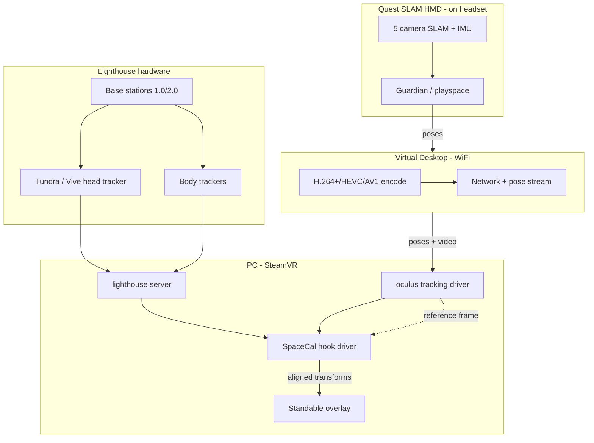

# Tracking stack research (2026)

**Last updated:** 2026-06-20  
**Reference chain:** Quest / Quest Pro (SLAM) → Virtual Desktop → SteamVR `oculus` → SpaceCal → lighthouse (head + body trackers) + Standable FBE

This document summarizes the **latest public information** on every tracking layer in this mixed setup, how they interact, and what that means for the contcal fork.

---

## Stack overview



**Critical insight:** This setup fuses **three independent pose pipelines** that do not share a clock or origin:

| Pipeline | Origin | Typical jitter | Drift type |
|----------|--------|----------------|------------|
| Quest SLAM | Guardian universe | High (~cm class) | Yaw + position over time |
| VD transport | Network extrapolation | Latency spikes | `poseTimeOffset`, frame drops |
| Lighthouse | Basestation frame | Low (sub-mm class) | Occlusion, multipath, reflections |

SpaceCal sits **between** SLAM reference and lighthouse targets — it cannot remove drift inside either pipeline, only align them continuously.

---

## 1. Meta Quest Pro (reference / SLAM)

### Technology

- **Inside-out 6DoF:** cameras + IMU sensor fusion on-device.
- **Quest Pro** adds more sensors than Quest 2/3 (face/eye tracking cameras; still fundamentally SLAM for head pose).
- Tracking runs in **Meta's runtime** before any PC streaming.

### Known behaviors (relevant to SpaceCal)

| Behavior | Impact on cont-cal |
|----------|-------------------|
| **Yaw drift** | Gyro integration drifts; magnetometer helps locally but is noisy near PC/metal ([Meta/Oculus sensor fusion docs](https://developers.meta.com/horizon/blog/magnetometer/)). This fork uses `trustTargetYaw` — lighthouse owns yaw, not Quest. |
| **Guardian / universe ID** | Recentering, room changes, or "finding position" events shift the SLAM origin. SpaceCal P3 `GuardianDrift` watches this. |

**Disabling Guardian entirely (Quest Pro dev settings):**  
Enable Developer Mode, then in headset Settings > System > Developer toggle off Guardian/Boundary (or use ADB `adb shell setprop debug.oculus.guardian_pause 1`). This removes Meta's boundary enforcement and greatly reduces guardian-induced origin shifts/recenters in the SLAM reference. Pairs well with SpaceCal's recent mitigations (force-apply stored chaperone for slam refs, `autoRecalOnGuardianDrift=false`, no sample buffer clears on drift). **Safety warning**: No boundaries; clear play area. May affect passthrough/MR apps. See our code changes for pushing lighthouse-aligned playspace. |
| **IMU extrapolation** | When cameras lose feature lock briefly, poses are predicted forward → spikes in reference pose. Fork gates: `poseTimeOffset`, `rejectYawDriftPoses`, spike rejection. |
| **Head model** | Quest reports a modeled head center, not a physical mount point. Offset error looks like body lean — tune `continuous_calibration_target_offset` XYZ. |

### SteamVR classification

This fork treats these as SLAM references (`VRState::IsSlamTrackingSystem`):

`oculus`, `holographic`, `winmr`, `pico`, `nreal`, `euler`

Quest via VD arrives as **`oculus`** in SteamVR.

### Latest ecosystem notes (2025–2026)

- Quest remains the dominant wireless PCVR headset; inside-out is the default industry direction.
- Guardian still resets occasionally (user reports of "finding position in room" on Quest 3 class devices).
- **Not fixable in SpaceCal:** SLAM drift inside Meta's stack.

---

## 2. Virtual Desktop (transport layer)

### Role

VD streams **video + tracking** from Quest to PC. For SteamVR mode it presents Quest as an `oculus`-class HMD to SteamVR — **not** native lighthouse.

### VDXR (Nov 2023+)

[UploadVR: VDXR runtime](https://www.uploadvr.com/virtual-desktops-vdxr-runtime/) — optional **OpenXR runtime inside VD** that bypasses SteamVR for supported games (~10% perf gain). **SpaceCal + lighthouse FBT requires SteamVR** (SpaceCal, Standable, lighthouse trackers), so this setup uses the **SteamVR path**, not VDXR.

### Streaming codecs & bitrate (Quest 3 class; Pro similar tier)

| Codec | Max bitrate (VD) | Use case |
|-------|------------------|----------|
| H.264+ | 400–500 Mbps | Fast motion, low latency feel |
| HEVC | 150–200 Mbps | General |
| AV1 | 200 Mbps (Quest 3+) | Efficiency |

Higher bitrate reduces artifacting but **does not eliminate pose latency** — WiFi jitter still affects `poseTimeOffset`.

### Latency & pose prediction

- VD adds **encode → network → decode → SteamVR compositor** delay.
- SteamVR receives poses that may be **time-stamped ahead or behind** lighthouse poses on the PC.
- This fork compensates partially: `compensatePoseTimeOffset`, `maxReferencePoseTimeOffset` (40 ms), `maxPoseTimeSkew` (50 ms).

**Staged Tracking ("Center to Playspace (Stage Tracking)") in VD:**  
In VD app (Quest) Settings > Streaming, the "Center to Playspace (Stage Tracking)" toggle forces stage-relative tracking. It anchors SteamVR's playspace/coordinates to the Quest's Guardian/stage origin for cross-session consistency and reduced drift with external trackers.  

- Normally **recommended ON** for MixedVR/FBT + SpaceCal (or SpaceOverride) to keep calibration stable without frequent recenters.  
- Turn **OFF** when you want more direct/raw tracking data and less forced anchoring to (even a disabled) Meta playspace. This helps your goal of reducing Meta guardian involvement.  

With Guardian/chaperone disabled on Quest + staged off: You get rawer Quest SLAM poses with minimal Meta playspace "staging". Complements our code (relaxed continuous-mode skew/offset gates, jitter-adaptive spikes, force-pushed stored chaperone). Trade-off: potentially more session-to-session playspace drift (staged tracking's main benefit). Test with metrics (error_byRelPose, jitterRef, continuous segment length) and `lock_relative_position=true`. |

### Practical tuning

- Wired PC ethernet, Quest on 5 GHz/6 GHz dedicated AP, low interference.
- Stable session > peak bitrate for cont-cal quality.
- **Ceiling limit:** two clocks (Quest vs PC) never genlocked.

---

## 3. SteamVR + mixed tracking universe

### How mixed systems coexist

SteamVR assigns each device a **tracking system name** (`oculus`, `lighthouse`, `standable`, etc.). Each system has its own internal origin. SpaceCal's driver **hooks** `TrackedDevicePoseUpdated` and applies a computed transform so devices in different systems appear aligned.

### Typical config

- HMD driver: `oculus` (VD)
- Head tracker: `lighthouse` (Tundra or Vive 3.0)
- Body: `lighthouse` + `standable` (FBE estimation layer)
- SpaceCal driver: `01spacecalibrator` at load priority 9999

### Chaperone / guardian copy

SpaceCal copies Quest guardian into profile and can auto-restore on geometry changes. VD guardian micro-shifts may trip guardian thresholds — contcal5 debounces at 35 mm / 5° / 3 confirms.

---

## 4. Lighthouse tracking (Valve SteamVR Tracking)

### Technology (still current for lighthouse hardware)

- **Lighthouse 1.0:** rotating sweep lasers, photodiodes on devices.
- **Lighthouse 2.0:** single rotor, wider FOV, up to 4 basestations, **10×10 m** max playspace ([Valve base station specs](https://www.valvesoftware.com/index/base-stations)).
- Claimed accuracy: **sub-millimeter** under good conditions ([Road to VR lighthouse analysis](https://roadtovr.com/analysis-of-valves-lighthouse-tracking-system-reveals-accuracy/)).

### Requirements for head-tracked FBT

| Factor | Why it matters |
|--------|----------------|
| **Line of sight** | Head tracker on strap — hair, hood, headset shell can occlude sensors. |
| **2+ basestations** | Opposing corners reduce occlusion for FBT + head mount. |
| **Rigid mount** | Flex on strap = lever arm error at head center. |
| **Reflective surfaces** | False returns, jitter — Vive troubleshooting guides apply. |

### Ecosystem shift (2025–2026) — important long-term

- **Steam Frame** (Valve's next headset) uses **inside-out cameras**, **not lighthouse** ([PCMag](https://www.pcmag.com/news/steam-frame-wont-support-legacy-lighthouse-trackers)).
- Valve Index manufacturing reportedly winding down; lighthouse is **legacy but not dead** — Tundra, Vive trackers, Pimax still depend on it.
- [SkarredGhost](https://skarredghost.com/2025/01/03/steamvr-tracking-future/): industry bifurcating into inside-out convenience vs lighthouse precision niche.
- **Lighthouse FBT remains valid for years** on PC, but is no longer the mainstream growth path.

---

## 5. Tundra Tracker (head mount)

### Hardware ([Tundra docs](https://tundra-labs.github.io/tundra-tracker-docs/tracker_hardware/))

| Spec | Value |
|------|-------|
| Photodiode sensors | **18** |
| Weight | ~46–50 g (base dependent) |
| Battery | ~9 h |
| Dongles | Tundra SW series, Vive dongle, Index headset radio, etee |
| Base stations | Vive 1.0, Vive 2.0, Index 2.0 |

### vs Vive Tracker 3.0 ([Vive blog comparison](https://blog.vive.com/us/vr-full-body-tracking-guide-pros-and-cons-of-tracker-technologies/))

| | Tundra | Vive 3.0 |
|--|--------|----------|
| Weight | ~50 g | 75 g |
| Sensors | 18 | More surface area (larger puck) |
| Community sentiment | Mixed — some jitter reports on head mount | Generally "reference grade" for head override |
| Price | ~$131 each | ~$130 |

### SpaceOverride stance on Tundra

[SpaceOverride README](https://github.com/Nyabsi/OpenVR-SpaceOverride): **Tundra not recommended for head override** — jitter on hip is annoying; on HMD it's nauseating. WIP support. **Vive 3.0 is the recommended head tracker** for SpaceOverride comparisons.

### IMU on Tundra

Community reports: Tundra has IMU for prediction between optical hits (like Vive tracker), but lighthouse pose is still optical-primary.

### For this fork

- Tundra as **target** (lighthouse) with Quest as **reference** (SLAM) is the intended hyblocker cont-cal pattern.
- Head-mount offset calibration is the highest-leverage P4 knob.

---

## 6. Standable Full Body Estimation (body layer)

### What it is ([Standable FAQ](https://standablevr.com/faq/))

- SteamVR plugin — **algorithmic** 11-point body estimation from HMD + controllers.
- **Not AI/ML** — IK/math from headset motion.
- Works with any SteamVR-visible tracker ("if SteamVR recognizes it, Standable can link").

### v3.0 (Dec 2025) — major rewrite ([patch notes](https://standablevr.com/patchNotesV3/))

| Feature | Relevance to cont-cal |
|---------|------------------|
| SteamVR overlay UI | In-VR tuning |
| Device Manager | Per-device roles, nicknames, input mixing |
| Offset & role memory | Survives crashes — less recal friction |
| Auto avatar calibration | VRChat one-button FBT align |
| Continuous floor calibration | Fights floor height drift (parallel problem to SpaceCal) |
| v3.1 planned | "Estimation update" for accuracy |

### Interaction with SpaceCal

```
Quest pose → SpaceCal aligns lighthouse trackers → Standable reads aligned trackers + HMD
```

Standable does **not** fix cross-system drift — it assumes SteamVR poses are already coherent. **SpaceCal quality directly affects Standable mixed-tracking quality.**

### Docs warning

Official Standable docs site is **outdated post-v3.0** — use Discord + Quick Start videos.

---

## 7. OpenVR SpaceCalibrator (software layer)

### Upstream state ([hyblocker fork](https://github.com/hyblocker/OpenVR-SpaceCalibrator))

| Item | Status |
|------|--------|
| Latest release | **v1.5.1** (Dec 2024) |
| Steam app | [3368750](https://s.team/a/3368750) |
| Active development | `develop` branch (211+ commits beyond release) |
| Primary issue class | [#50 continuous cal drift bursts](https://github.com/hyblocker/OpenVR-SpaceCalibrator/issues/50) — opened **Jun 2026**, Quest Pro + head tracker, describes 3–6 cm bursts — **the contcal fork target** |

### Architecture

1. **Overlay** — samples poses, runs calibration math, saves profile.
2. **Hook driver** — intercepts `TrackedDevicePoseUpdated`, applies alignment transform via IPC.
3. **Continuous cal** — repeated incremental alignment using head-mounted tracker as bridge.

### Two modes (user confusion explained)

| Mode | What user feels |
|------|-----------------|
| **Saved calibration** | Driver applies stored transform every second — "it just works" |
| **Continuous calibration** | Overlay actively refines — needed for SLAM drift recovery |

Many users run **saved calibration only** (autostart off) and wonder why drift returns — enable **autostart continuous calibration** for long Quest sessions.

### This fork additions (contcal1–5)

- SLAM preset, `trustTargetYaw`, spike rejection, guardian P3, multi-chain, IPC retry, lock-relative gate, bad-frame prune, 1 Hz metrics

---

## 8. SpaceOverride (alternative architecture)

### Difference ([README](https://github.com/Nyabsi/OpenVR-SpaceOverride))

| | SpaceCal cont-cal | SpaceOverride |
|--|-------------------|---------------|
| Approach | Align SLAM universe to lighthouse continuously | **Replace HMD pose** with tracker-derived pose after one cal |
| Drift | Fights ongoing SLAM drift | HMD effectively **becomes** lighthouse device |
| VD compatible | Yes | Yes (confirmed) |
| Tundra for head | Workable with cont-cal | **Not recommended** — use Vive 3.0 |
| Conflicts with SpaceCal | — | Can coexist; solves problem differently |

### When to A/B test

After P4 baseline metrics with Tundra + contcal5, swap head tracker to **Vive 3.0** and try SpaceOverride for ceiling comparison — especially if cont-cal hits logical limit.

---

## 9. Upstream issue #50 — community validation

[Issue #50](https://github.com/hyblocker/OpenVR-SpaceCalibrator/issues/50) (Jun 2026):

- Quest Pro + head calibration tracker + Vive body trackers
- **3–6 cm bursts for ~5 s** then snap back
- Steady state fine sub-mm
- Suspected `CollectSample` `&&`/`||` bug in pose gate (addressed in contcal2)
- Worse with lock relative position **off** — enable it for Quest setups

This fork addresses the exact failure mode upstream has not shipped.

---

## 10. Comparative tracker landscape (2026)

| Technology | Examples | Precision | Setup | This fork |
|------------|----------|-----------|-------|------------|
| Lighthouse | Tundra, Vive 3.0 | Highest | Basestations | **Primary** |
| SLAM HMD | Quest Pro | Medium | None | **Reference** |
| IMU-only | SlimeVR, HaritoraX | Medium-low | None | Not used |
| Self-tracking CV | Vive Ultimate | High (no BS) | Dongle | Not used |
| Estimation | Standable FBE | N/A (inferred) | Software | **Body fill-in** |

[Vive Ultimate Tracker](https://www.vive.com/us/accessory/vive-ultimate-tracker/) is the growth product from HTC — inside-out trackers, PC SteamVR support expanding, but **different tracking system** — would add a fourth universe to align.

---

## 11. Implications for this fork

### What research confirms the design gets right

1. **Head-mounted lighthouse tracker** is the correct pattern for Quest + FBT (hyblocker, SpaceOverride, #50 all converge here).
2. **`trustTargetYaw`** matches theory — Quest yaw is the noisy degree of freedom.
3. **Guardian drift handling** is mandatory for VD Quest, not optional polish.
4. **Tundra → Vive 3.0** upgrade path is evidence-backed before SpaceOverride head drive.
5. **Lighthouse ecosystem** still maintained (Tundra Labs active) but industry headline is inside-out (Steam Frame).

### What research says not to chase

- Sub-5 mm SLAM-lighthouse fusion on VD Quest with hook-driver only — physics ceiling.
- Upstream v1.5.1 alone for Quest cont-cal — unreleased fixes, active bugs.
- Tundra for SpaceOverride head drive — author explicitly warns against it.

### Recommended follow-ups for contributors

1. **P4 session** with 1 Hz logging — quantify median `error_byRelPose` over 10+ min ([P4_TUNING.md](./P4_TUNING.md)).
2. **Vive 3.0 head A/B** — same metrics script, same protocol.
3. **SpaceOverride A/B** — subjective HMD stability + body lock; use Vive 3.0 on head per author guidance.
4. **Watch hyblocker #50** — upstream may merge overlapping fixes; cherry-pick opportunity.

---

## Sources

| Topic | Link |
|-------|------|
| SpaceCal upstream | https://github.com/hyblocker/OpenVR-SpaceCalibrator |
| Issue #50 drift | https://github.com/hyblocker/OpenVR-SpaceCalibrator/issues/50 |
| SpaceOverride | https://github.com/Nyabsi/OpenVR-SpaceOverride |
| Tundra hardware | https://tundra-labs.github.io/tundra-tracker-docs/tracker_hardware/ |
| Standable v3 | https://standablevr.com/patchNotesV3/ |
| VD VDXR | https://www.uploadvr.com/virtual-desktops-vdxr-runtime/ |
| Valve base stations | https://www.valvesoftware.com/index/base-stations |
| Vive tracker guide | https://blog.vive.com/us/vr-full-body-tracking-guide-pros-and-cons-of-tracker-technologies/ |
| Steam Frame / lighthouse future | https://www.pcmag.com/news/steam-frame-wont-support-legacy-lighthouse-trackers |
| SLAM yaw / magnetometer | https://developers.meta.com/horizon/blog/magnetometer/ |
| Fork docs | [ROADMAP.md](./ROADMAP.md), [P4_TUNING.md](./P4_TUNING.md), [CHANGELOG-contcal.md](./CHANGELOG-contcal.md) |